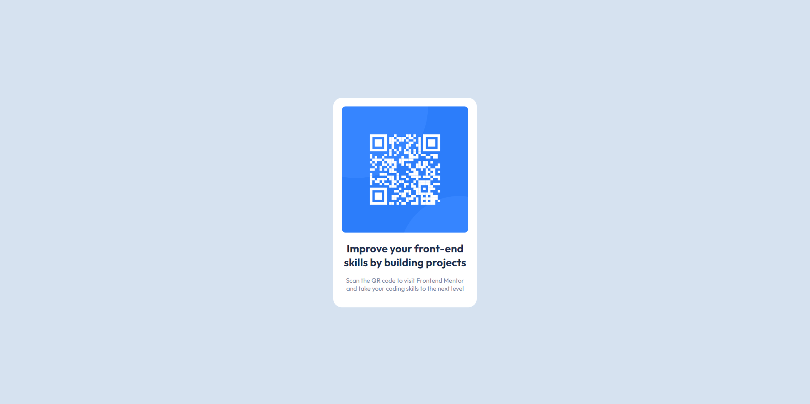

# Frontend Mentor - Solución QR code component

Esta es una solución al desafío [QR code component challenge on Frontend Mentor](https://www.frontendmentor.io/challenges/qr-code-component-iux_sIO_H). Los desafíos de Frontend Mentor lo ayudan a mejorar sus habilidades de codificación mediante proyectos realistas.

  

## Visión General

### Screenshot

  

### Links

- URL de la solución: [https://qr-code-component-ruddy.vercel.app/](https://qr-code-component-ruddy.vercel.app/)

- URL de app en vivo: [https://github.com/IscMiguelAngel/qr-code-component](https://github.com/IscMiguelAngel/qr-code-component)

  

## Mi proceso

### Construído con

- Marcado HTML5 semántico

- Propiedades personalizadas de CSS (Preprocesado con SASS)

- Flujo de trabajo centrado en dispositivos móviles

- [React](https://reactjs.org/) - Librería JS
- [SASS] - Para los estilos

  
## Ejecutar proyecto
  ### Instalar módulos de Node
  - npm install
  ### Instalar SASS
  - npm install sass

## Autor

  

- Linkedin- [Isc Miguel Angel](https://www.linkedin.com/in/isc-miguel-angel)

- Git Hub- [IscMiguelAngel](https://github.com/IscMiguelAngel)

- Frontend Mentor - [@IscMiguelAngel](https://www.frontendmentor.io/profile/IscMiguelAngel)
